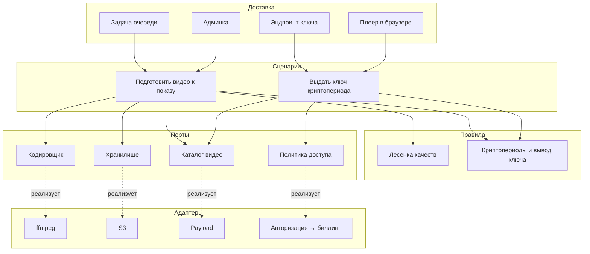
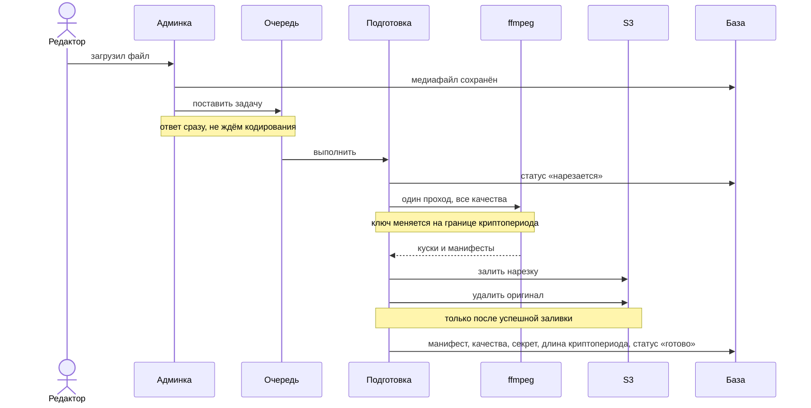
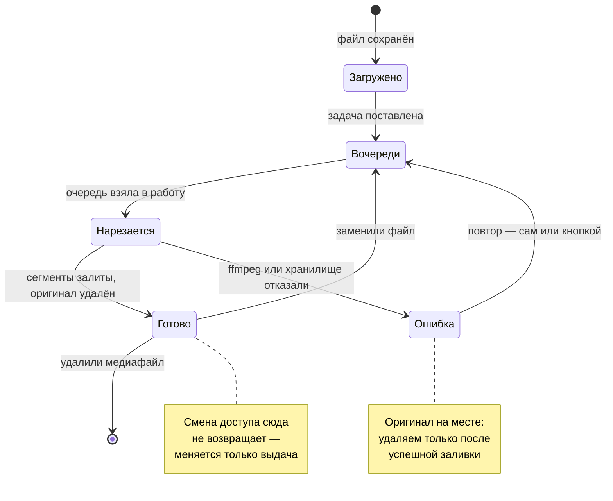
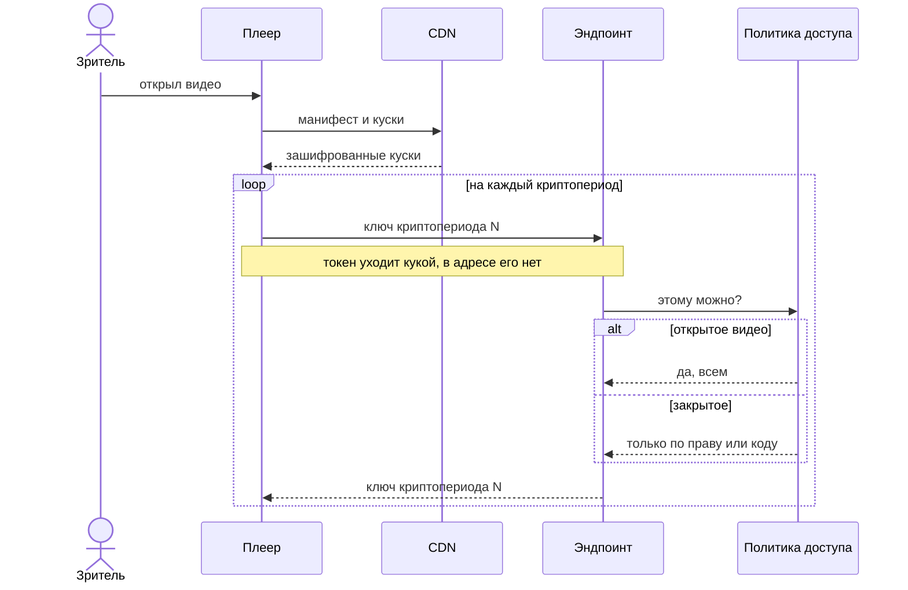
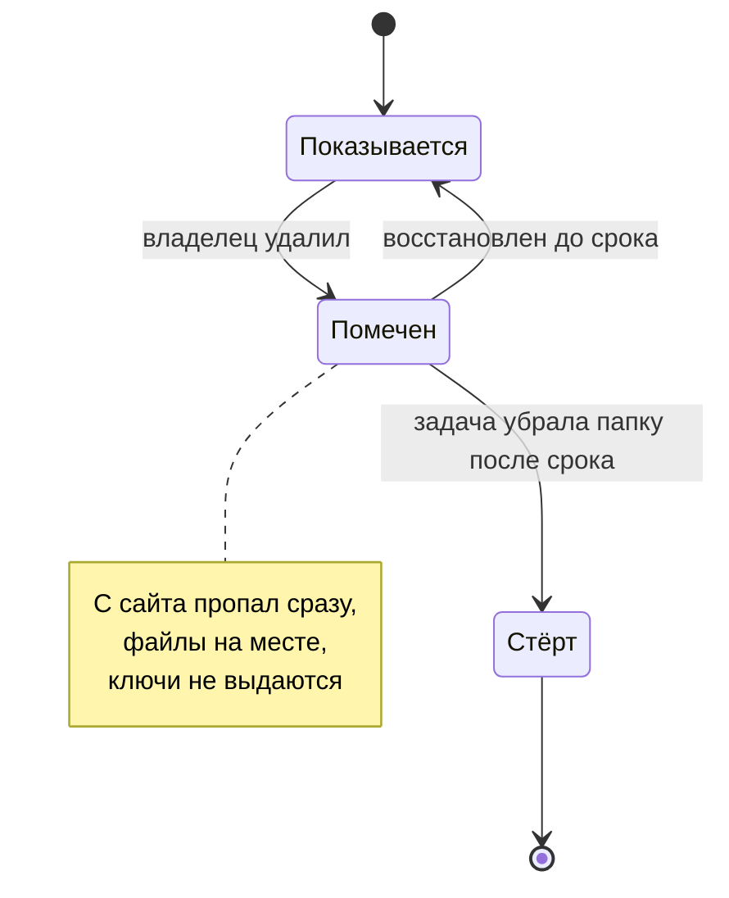
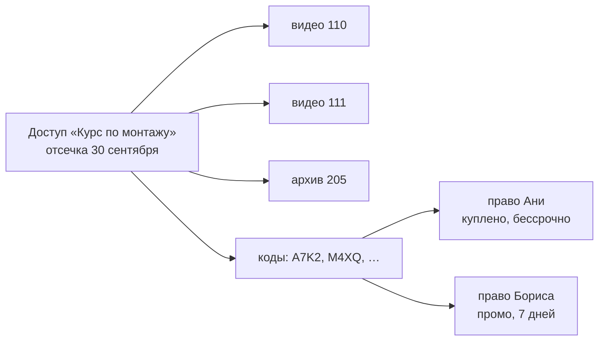

# Видео: нарезка, доступ, показ

> Загрузил видео в админку — дальше всё само. Зритель получает плеер с мгновенным стартом,
> перемоткой на любую секунду и выбором качества. Раздача с CDN, хранение — подключённый S3.

## Что решаем

Обычный `mp4` в теге `<video>` отдаётся одним файлом в одном качестве. На телефоне в поле это
либо долгая загрузка видео в 1080p, либо мыло для всех, а перемотка тянет файл целиком.
Плюс такой файл нельзя закрыть: ссылка на него либо публична, либо не работает.

Поэтому видео режется на короткие сегменты в нескольких качествах (HLS) и всегда шифруется.
Дальше публичность — это не способ хранения, а **политика выдачи ключа**.

## Слои

Границы проведены так, чтобы механика нарезки ничего не знала ни о Payload, ни об S3, ни о том,
кому можно смотреть. Каждый следующий слой зависит только от абстракций предыдущего.

Практический смысл границ: заменить S3 на другое хранилище, ffmpeg на внешний сервис кодирования, а проверку «авторизован ли» на биллинг — это замена одного адаптера, без правок в сценариях и правилах.

## Как готовится видео

По умолчанию ступеней две - 480p и 720p: первая вытягивает мобильный интернет, вторая закрывает остальное, а разницу с 1080p на телефоне почти никто не заметит. Ступени задаются в настройках сайта, и каждая лишняя - это ещё одна дорожка в том же проходе и место в хранилище.

Кодирование живёт в фоновой задаче.

Оригинал удаляется после успешной нарезки, всегда. Смотрят через манифест, а гигабайтный файл занимает больше места, чем обе ступени вместе. Если нарезка упала — оригинал на месте, задачу
можно перезапустить.

### Состояния медиафайла

Главное в этом автомате: **смена доступа не является переходом**. Открытое становится закрытым и обратно без возврата в нарезку — иначе каждое переключение стоило бы минут кодирования.

Второе: `Ошибка` не теряет исходник. Удаление оригинала — часть перехода в `Готово`, и только после того, как все сегменты легли в хранилище.

## Ключи

### Ключ на криптопериод

Запись делится на криптопериоды - группы сегментов подряд. У каждого криптопериода свой ключ, и получить их можно только по одному, запрашивая каждый отдельно.

Ключи не хранятся. Ключ криптопериода выводится из секрета записи и номера криптопериода односторонним выводом (HKDF на SHA-256), поэтому нарезка и выдача приходят к одному значению независимо друг от друга, а в базе не появляется склад секретов, растущий с длиной записи.

Вывод односторонний, и отсюда два свойства. Из ключа криптопериода не получить ни секрет записи, ни ключ соседнего криптопериода. И секрет записи не покидает сервер вовсе: зритель с полным правом видит только
ключи тех криптопериодов, до которых дошёл.

Длина криптопериода — настройка, по умолчанию минута, то есть пятнадцать сегментов при четырёхсекундной нарезке. Это мера того, что отдаёт утёкший ключ. Записанный шаг лежит у самой записи: настройка
действует только на то, что нарезается после её изменения, иначе смена значения пересчитала бы границы у всего уже нарезанного и оно перестало бы играть.

Записи, нарезанные до появления криптопериодов, помечены пустым шагом. Им выдаётся единственный ключ, как и раньше: перенарезка для них не требуется.

### Как выдаётся ключ

Номер криптопериода уходит в адрес выдачи прямо при нарезке: ffmpeg пишет его в манифест там, где сменил ключ. Плеер, дойдя до сегмента, запрашивает адрес из манифеста, и сервер отдаёт ключ этого криптопериода.

Право проверяется на каждом запросе, поэтому отзыв срабатывает на ближайшей границе криптопериода, а не
после того, как зритель закончит.

Чтобы собрать запись целиком, нужно запросить каждый ключ, и частота обращений ограничена темпом просмотра. Запас - тридцать разных ключей залпом, дальше по одному в двадцать секунд. Столько же длится самый короткий криптопериод, какой принимает настройка: пять частей по четыре секунды. Ниже она не пускает - иначе зритель просил бы ключи быстрее, чем они возвращаются, и упирался бы в предел посреди просмотра. Зритель в предел не упирается никогда, сколько бы ни смотрел, а сбор всех ключей стоит примерно того же времени, что и просмотр.

Считаются именно разные ключи: страница держит плеер и в блоке, и в подборке, и все просят один и тот же - повтор запаса не тратит. Выданный ключ помнится полчаса, дальше считается новым, иначе набор «уже виденных» стал бы проходом мимо предела.

Счёт лежит в базе, а не в памяти процесса: при выкладке рядом работают два цвета на одной базе, и память у каждого своя - смена цвета возвращала бы выкачивающему полный запас. Строки, которых не касались сутки, убирает ночная задача.

Ответ помечен как некешируемый и идёт мимо CDN. Сами части кешируются на общих основаниях — они одинаковы для всех зрителей.

### Адрес ключа в манифесте

В манифест пишется путь на дверь сайта, без домена: `URI="/internal/video/key/87?p=0"`. Номер записи и номер криптопериода в нём есть, домена нет - иначе он цементируется в файле навсегда, и при переезде сайта записи несут в себе прошлый адрес.

Адрес пишется сразу тем, по которому и надо идти. Форму его знает одно место - нарезка; ни ручка манифеста, ни загрузчик плеера её не собирают и не правят. Стоило завестись второму такому месту, как оно молча разошлось с первым: сервер сменил адрес, загрузчик остался на прежнем, запись играла, а зритель без права видел мёртвый кадр вместо формы кода.

Относительный путь браузер разрешает **от адреса манифеста**, а не от адреса страницы. Поэтому манифест отдаётся зеркальной ручкой сайта, а не адресом раздачи: файл остаётся в хранилище рядом с сегментами, но плеер берёт его с домена сайта, и путь ключа разрешается туда же.

Где лежат файлы, шаблон при этом не знает: у одного сайта раздача за тем же доменом, у другого отдельный поддомен, у третьего чужое облако. Ручка приводит к своим ссылки на файлы - сегменты уводит прямо в раздачу, вложенные манифесты оставляет за собой. Строку ключа не трогает вовсе. Через сайт идёт пара килобайт текста, мегабайты мимо.

### Где лежит секрет потока

В базе, рядом с самим видео, но не открытым текстом: он завёрнут в мастер-ключ, который живёт в Infisical и в базу не попадает. Наружу поле не отдаётся никогда — чтение через API закрыто, включая администратора.

Вариант «держать сами секреты в Infisical» отклонён: секрет свой у каждого видео, то есть на тысячу видео пришлась бы тысяча записей в хранилище конфигов, поход по сети на каждую выдачу ключа и остановка показа, когда хранилище недоступно. Мастер-ключ же один на сайт: его достаточно прочитать один раз и держать в памяти.

Что это даёт:

- **утёкший дамп базы бесполезен** — без мастер-ключа секреты не развернуть;
- **ротация мастер-ключа не трогает видео** — перезаворачиваются только секреты, сегменты остаются прежними, и кеш сети раздачи не сбрасывается;
- **подмена значения в базе не проходит молча** — шифрование с меткой подлинности, испорченная
  запись даёт ошибку, а не мусор в плеере.

Переменная называется `VIDEO_MASTER_KEY`, 32 байта в base64. Пустое значение допустимо: тогда
секреты хранятся как раньше, и видео, залитые до появления ключа, продолжают играть.

### Токен зрителя

Токен подписан секретом приложения и несёт две вещи: срок и идентичность зрителя. Прав в нём нет - они лежат отдельными записями и находятся по опознанию, поэтому выданное отзывается без выдачи нового токена.

Живёт токен в куке, закрытой от скриптов. Плеер его не читает и никуда не подставляет — браузер прикладывает куку сам.

## Доступность и публикация — разные вещи

У записи два вида статусов, и они ни от чего не зависят друг у друга.

Статус **Доступности** определяет, кому выдаётся ключ: открытое смотрят все, закрытое — тот, у кого есть право или код. **Публикация** решает, попадает ли запись в перечни: опубликованное
стоит в витрине канала, скрытое находится только по ссылке.

| Доступ   | Публикация   | Что получается                                   |
| -------- | ------------ | ------------------------------------------------ |
| закрытое | опубликовано | Витрина платного: видно с замком, играет по коду |
| открытое | опубликовано | Обычная запись                                   |
| открытое | скрыто       | Раздаётся ссылкой, в перечнях не появляется      |
| закрытое | скрыто       | Заготовка: не видна и не играет                  |

Новая запись создаётся **закрытой и скрытой**. Иначе платное оказывалось бы доступным всем
с той минуты, как дорезалось, и до той, когда автор вспомнит переключить.

У подборки настройка публикации своя и работает так же.

## Адреса: канал, видео, плейлист

У видео есть короткий код — семь символов из алфавита без похожих начертаний. Номер медиафайла
в адрес не годится: по нему видео перебираются подряд, закрытые обнаруживаются увеличением
числа, а заодно видно, сколько всего загружено.

| Адрес               | Что показывает                                            |
| ------------------- | --------------------------------------------------------- |
| `/@<канал>`         | Страница автора: опубликованные записи, закрытые с замком |
| `/@<канал>/v/<код>` | Страница видео: плеер, описание, разметка для поиска      |
| `/@<канал>/p/<код>` | Страница плейлиста: уроки по порядку, закрытые с замком   |

Канал — это **страница автора, а не отдельная сущность**. Участники в шаблоне уже есть, и завести
рядом «каналы» значило бы держать два профиля на одного человека. Сейчас там только видео;
галерея и остальное встанут туда же, когда появятся.

Со статьями это пока не сошлось: у блога свой автор отдельной коллекцией и своя страница `/blog/author/<адрес>`. То есть на одного человека всё-таки заведены два профиля, и их предстоит свести.

Видео и плейлист ищутся отдельными эндпоинтами, а не запросом к медиа с фильтром: чтение участников закрыто для посторонних, поэтому в обычной выдаче автор приходит номером и сверить канал нечем.
Адрес сверяется целиком — иначе одна запись открывалась бы с любым именем в ссылке, и поисковик видел бы десяток дублей одной страницы.

### Авторство и область хранения

Автор проставляется при загрузке сам и задаёт, куда лягут сегменты: `u<id автора>/hls/<uuid>`.
Ключом идёт неизменяемый идентификатор, а не имя канала — переименование иначе потребовало бы
перекладывать сегменты и обнулило бы кеш CDN. Залитое не от лица участника (перенос, скрипт) ложится в `shared/hls/<uuid>`.

Что это даёт: удалить всё хозяйство участника — это один префикс, а не обход базы; посчитать занятое им место — тоже; и границы для разграничения доступа на уровне бакета уже проведены.

Авторство и права — разные вещи. Авторство это факт: кто залил. Права даёт роль: что человеку можно, включая доступ в админку.

## Удаление с отсрочкой

Удаление записи — единственное необратимое действие: оригинала уже нет, только сегменты. Поэтому
запись сначала помечается, а стирается отложенно.

Помеченная запись перестаёт отдавать ключи в тот же момент — иначе прямая ссылка продолжала бы
играть то, что владелец убрал. Срок хранения помеченного — настройка, месяц по умолчанию.

## Плейлисты, права и коды

> **Два разных «плейлиста».** В HLS так называется технический файл `master.m3u8` — оглавление кусков одного видео; он появляется у каждого нарезанного видео.
> Плейлист же — это подборка видео, и её у видео может не быть вовсе. Дальше в тексте первый называется **манифестом**, второй — **плейлистом**.

Закрытое открывают три вещи, и у каждой своя забота.

> Так это устроено по модели. Нынешний код держит прежнюю раскладку - доступа
> как сущности в нём ещё нет; что именно расходится, перечислено в конце
> [`41-access.md`](41-access.md).

**Доступ** - то, что продают и то, что отбирают целиком. Он безличен: не «Аня купила», а «Курс
по монтажу открыт». Знает, какие материалы в него входят, и держит общий срок - дату отсечки.
Пусто - бессрочно; будущая дата - общий срок акции; сегодняшняя - закрылось у всех разом. Отдельного
рубильника не нужно, дата им и работает.

**Право** - личные данные: что человек купил и как договорились. Своя дата истечения, своё число
просмотров со счётчиком, чем приобретено - оплатой, кодом, приглашением или рукой владельца - и
номер источника: конкретный код или номер платежа. Действует право или нет, **вычисляется** из этих
условий, а не хранится флагом: иначе истёкшее пришлось бы кому-то гасить, а до тех пор оно пускало бы.

**Код** - билет к доступу. Кончается активацией и заводит право с теми условиями, о которых
договорились. Кодов к одному доступу сколько угодно: сотня кодов на поток - это сотня прав, а не
сотня копий доступа.

Проверка идёт в два шага и в этом порядке: жив ли доступ, и только потом смотрим право. Доступ
закрыли - дальше не идём вовсе, сколько бы прав под ним ни выдали. Срок считается по более раннему
из двух, личного и общего.

Аня купила пятого сентября без личного ограничения - её закрывает отсечка доступа. Борис вошёл
по промо двадцать седьмого на неделю - его условие короче, но и оно упирается в ту же отсечку,
и смотрит он до тридцатого, а не до четвёртого октября. Акцию продлили - правится одно поле
в доступе. Свернули раньше - ставится сегодняшнее число, и закрывается у всех; права при этом целы,
вернул дату - всё заработало без перевыдачи.

Плейлист остаётся списком: подборка не выдаёт прав и не отнимает их. Каскад «закрытый плейлист
закрывает свои видео» намеренно не сделан - он сделал бы невозможным платный курс с бесплатным
вводным уроком, а это основной способ курс продать. Запись, входящая в несколько курсов,
открывается доступом к любому из них.

Способ приобретения знает право, а не доступ. Придёт платёжка - встанет сюда же, и ни плеер,
ни нарезка об этом не узнают.

### Кто такой зритель

Право зрителя хранит то, чем человек узнаётся, - его идентичность. Сейчас она одна:
маркер, который сервер выдаёт браузеру при первой встрече, поэтому записать право
есть куда всегда, даже когда о человеке не известно ничего.

Учётная запись, телефон и почта - её же виды, и приведение номера с почтой
к единому виду уже написано: иначе тот же номер не совпал бы сам с собой при
возврате с другого устройства. В ходу их пока нет - регистрации зрителей у сайтов
на шаблоне не существует, - и лежат они заделом под связывание, когда зритель
заведёт себе имя на сайте. Тогда покупку перестанет терять и тот, кто вычистил
данные браузера: право найдётся по подтверждённому номеру.

### Коды и ссылки

Код - билет к доступу, а не запись о нём: погашённый, он отдаёт токен и кончается. Что именно
откроется, решает доступ, от которого код напечатан, - подборка, отдельная запись или набор
из нескольких ресурсов сразу.

Код и ссылка-приглашение — разные вещи и живут раздельно. Код диктуют голосом, поэтому он короткий и в раскладке Crockford Base32, где из каждой пары похожих начертаний остаётся ровно
один символ: привычная опечатка (`O` вместо нуля, `I` вместо единицы) исправляется однозначно.
Ссылку присылают, набирать её руками не нужно, поэтому она длиннее и из широкого алфавита — короткая ссылка подбиралась бы перебором.

Погашение записывает право и связывает его с идентичностью человека. Поэтому выданное
отзывается - и поштучно, и целым доступом сразу: сервер о нём знает, в отличие от схемы, где
купленное жило бы внутри токена и отобрать его было бы нечем.

Подбор придерживается задержкой: после нескольких промахов пауза растёт.

Вход код не требует: кто его получил, тот получил и право. Сдерживают код срок
и число срабатываний - разойдясь по чатам, он иначе открыл бы курс каждому, кто
его увидел. Оба проставляются сами: не указан срок - берётся из настроек сайта,
не указано число - ставится пятьдесят. Отозвать выданное можно и поштучно,
и целым доступом сразу, потому что каждое право лежит записью.

## Почему это дружит с CDN

Части шифруются один раз при нарезке и одинаковы для всех зрителей — отсюда растёт вся выгода схемы.

**Файлы не переписываются никогда.** Открыть закрытое или закрыть открытое — это смена одного поля в базе: меняется решение о выдаче ключа, а байты на диске остаются прежними. Никакого повторного прохода по видео, никакого ожидания. Час видео переключается мгновенно и столько раз, сколько нужно.

**Кеш общий на всех зрителей.** Раз часть одна и та же для каждого, узел сети раздачи кладёт её один раз и отдаёт всем. Origin отдаёт кусок однократно, дальше сеть работает сама.

**Закрытое лежит в этом кеше на равных.** Без ключа часть — набор случайных байт, поэтому платная подборка спокойно копируется на узлы по всей стране, и это не утечка: зритель в другом городе получает видео с ближайшего узла, а не через полстраны.

Мимо кеша идут только запросы за ключами. Они весят десятки байт против сотен мегабайт самого видео.

## Что защищено, а что нет

Задача — сделать слив дороже покупки, а не объявить его невозможным. Слои работают каждый на свой случай.

**Части зашифрованы всегда**, у открытых записей тоже. Скачанная часть без ключа — набор случайных байт, а исходник после нарезки удаляется. Поэтому утёкший адрес ничего не даёт, и короткоживущие ссылки на части не делаются: подписывать тут нечего, а уникальный для каждого адрес выбивал бы части из кеша.

**Ключи выдаются по одному, по праву и в темпе просмотра.** Это закрывает основной случай — чужую программу, которая берёт манифест, дёргает единственный ключ и уносит запись целиком.

**Ключ выдаётся только своему сайту.** Чужая страница, встроившая поток, получает отказ: платный курс не должен крутиться на стороннем сайте под чужой рекламой. От выкачивания это
не спасает, заголовки подделываются; здесь заслон от чужой витрины.

**Складчина видна в журнале.** Пока ключ был один на всю запись, зритель показывался ровно однажды, и десять человек по общему коду ничем не отличались от одного. С ключами по криптопериодам каждый обращается заново, и под одним правом становятся видны отдельные линии: у каждой свой клиент и своё место в записи. Больше трёх живых линий или разные места одновременно - и владелец видит это в журнале. Отказом сервер не отвечает: две-три линии даёт и один человек - телефон рядом с компьютером, вторая вкладка, - а обрывать доступ за обычное поведение нельзя. Решение остаётся за владельцем.

**Закрытая запись подписана зрителем.** Поверх кадра медленно ходит полупрозрачная метка: у вошедшего - его почта, у пришедшего по коду - короткий отпечаток выданного токена. Копированию она не мешает, зато слив приводит прямо к сливающему и переживает и съёмку экрана, и пересжатие. На открытых записях метки нет: смотреть их можно без условий, и портить кадр посторонним текстом незачем.

### Чего схема не закрывает

Ключ в итоге попадает в браузер — так устроен формат. Значит зритель, у которого право есть, может снять просмотр тремя способами, и все три остаются доступными:

1. **Из памяти плеера** / **Запись экрана** - метка зрителя остаётся на записи и указывает, чей это доступ.
2. **Перехватом по HDMI** Коробка между компьютером и монитором пишет сигнал целиком
3. **Камерой с экрана** Не закрывается ничем в принципе.

Закрывает первый и частично второй только Multi-DRM: ключ уходит в модуль расшифровки браузера, минуя страницу, а на старших уровнях закрывается и вывод.

### Multi-DRM: рассмотрен, не применяется

1. **Потребитель.** Сайты шаблона — микро- и малый бизнес: уроки, консультации, разборы, показ работ. Клиенты, которым нужна защита такого уровня, здесь не предполагаются.
2. **Материал.** Наружу уходит не исходник, а перекодировка: по умолчанию 480p и 720p, выше - если владелец сам добавил ступень. Исходник удаляется после нарезки, поэтому слив отдаёт то же, что видел зритель.
3. **Обход остаётся.** Перехватчик HDMI даёт запись, по качеству практически равную тому, что лежит на сервере. Разница, за которую платят DRM, на таком материале не набирается.
4. **Цена.** Сервер лицензий, переупаковка в CMAF, сертификаты трёх поставщиков, у Apple — по заявке. Отдельная подсистема на постоянном содержании.
5. **Кому нужно — подключает сам.** Плеер собран на движке, который умеет работать с защищённым воспроизведением. Владелец, которому такой уровень действительно нужен, заводит лицензионный сервер и настраивает его под себя; в шаблон это не встраивается.

## Обоснование зависимостей

Каждая внешняя зависимость — это то, что придётся чинить, когда оно сломается. Ниже почему взято именно это и что рассматривалось взамен.

### Кодирование — ffmpeg

Системная утилита в образе, вызывается как процесс. Шифрование и смена ключа по ходу нарезки — штатные возможности его HLS-муксера, поэтому своего шифрования частей в коде нет.

| Вариант                                 | Почему не он                                                                                                                                                                         |
| --------------------------------------- | ------------------------------------------------------------------------------------------------------------------------------------------------------------------------------------ |
| npm-обёртки над ffmpeg                  | Ломаются на каждом обновлении и добавляют слой без пользы: набор ключей ffmpeg стабилен годами, обёртка — нет.                                                                       |
| `ffmpeg.wasm` в браузере                | В разы медленнее нативного, требует открытой вкладки на всё время, съедает батарею телефона. Контент грузят с объекта, это исключено.                                                |
| Внешний сервис (Mux, Cloudflare Stream) | Ежемесячный счёт за каждый инстанс шаблона и зависимость от чужого тарифа. Для сайта подрядчика с десятком видео — неоправданно. Порт `Кодировщик` оставляет такую замену возможной. |

Лицензия ffmpeg на наш код не распространяется: это отдельный процесс, а не библиотека,
слинкованная в приложение.

### Плеер — hls.js как движок, два слоя управления поверх

Разделение осознанное: `hls.js` играет поток, а внешний вид даёт отдельная библиотека.
Слоёв два, `media-chrome` и `vidstack`; какой показывать, решает настройка возможностей,
и оба лежат на одном движке.

| Вариант                       | Состояние на август 2026                     | Решение                                                                                       |
| ----------------------------- | -------------------------------------------- | --------------------------------------------------------------------------------------------- |
| **hls.js** 1.7, Apache-2.0    | Обновляется, то же ядро под всеми оболочками | Берём как движок: он умеет ходить за ключами с нашими условиями и поддерживает смену ключа.   |
| **media-chrome** 4.19, MIT    | Живой, от Mux                                | Берём как интерфейс: веб-компоненты, стилизуются нашими токенами.                             |
| **vidstack** 1.15, MIT        | Живой                                        | Взят вторым слоем управления: переключается настройкой, движок остаётся общим.                |
| **plyr** 3.8.4, MIT           | Редкие обновления, вливается в Video.js v10  | Отклонён: переезжает.                                                                         |
| **video.js** 8.24, Apache-2.0 | Живой, но v10 в переписывании                | Отклонён: класть в шаблон библиотеку в разгар мажорной переделки рано.                        |
| Свой плеер с нуля             | —                                            | Отклонён: месяцы работы на то, что уже сделано, и собственные баги вместо чужих исправленных. |

### Хранилище — @aws-sdk/client-s3

Официальный SDK, уже в зависимостях ради загрузки медиа. Отдельная библиотека под сегменты
не нужна. Совместимо с любым S3-провайдером, включая MinIO для локальной разработки.

### Очередь — Payload Jobs Queue

Встроенная: повторы, история запусков, кнопка ручного запуска в админке.

| Вариант                   | Почему не он                                                                                  |
| ------------------------- | --------------------------------------------------------------------------------------------- |
| BullMQ                    | Тянет Redis в стек ради одной задачи.                                                         |
| node-cron в процессе      | Нет истории, нет повторов, нет ручного запуска, умирает вместе с процессом.                   |
| Системный cron на сервере | То же самое плюс невидимость для владельца сайта. Годится как запасной путь, не как основной. |

### Шифрование — AES-128 средствами ffmpeg, вывод ключей на node:crypto

Штатная возможность формата, поддержана всеми плеерами. Вывод ключа криптопериода собирается стандартной
библиотекой `node:crypto`, без зависимостей.

## Что настраивается без разработчика

| Настройка                                     | Где                     |
| --------------------------------------------- | ----------------------- |
| В какие качества резать                       | Настройки сайта → Видео |
| Сколько частей идёт под одним ключом          | Настройки сайта → Видео |
| Через сколько дней стирать удалённые записи   | Настройки сайта → Видео |
| Длина кода доступа                            | Настройки сайта → Видео |
| Сколько минут живёт код                       | Настройки сайта → Видео |
| На сколько дней код открывает доступ          | Настройки сайта → Видео |
| Что показывать вместо закрытой записи         | Настройки сайта → Видео |
| Доступ: открытая запись или закрытая          | Карточка медиафайла     |
| Публикация: опубликована или скрыта           | Карточка медиафайла     |
| Название и описание записи                    | Карточка медиафайла     |
| Показывать ли название и описание под кадром  | Блок видео на странице  |
| Субтитры и главы записи                       | Карточка медиафайла     |
| Состав подборки и порядок записей             | Карточка подборки       |
| Публикация подборки                           | Карточка подборки       |
| Обложка подборки                              | Карточка подборки       |
| Закрыть или открыть все записи подборки разом | Карточка подборки       |
| Что входит в доступ и до какой даты он открыт | Доступы                 |
| Кому доступ выдан и на каких условиях         | Права                   |
| Коды и ссылки, открывающие доступ             | Коды доступа            |
| Вид плеера                                    | Возможности             |

## Что умеет плеер

Привычки зрителя сложились до нас, и спорить с ними нечем: всё, чего нет из привычного набора, читается как недоделанный плеер, а не как наш выбор. Поэтому плеер ведёт себя так же, как на площадках, к которым человек привык.

**Субтитры.** Дорожки заводятся у записи в админке: язык, подпись и файл. Одну можно пометить включённой сразу — она достанется тем, кто ничего не выбирал сам. Перенарезка при этом не нужна: дорожка лежит отдельным файлом рядом.

**Оглавление.** Главы задаются строками — с какой секунды начинается кусок и как он называется. Полоса времени делится на части, и до нужного места доходят одним нажатием. Дорожка для плеера собирается в браузере, файла на диске не появляется: владелец правит строки, а не разметку.

**Кадры при перемотке.** Лента кадров снимается той же обработкой, что и нарезка, и кладётся рядом с ней. Промежуток считается от длительности: у короткой записи кадры чаще, у часовой реже. Все кадры лежат одной картинкой — сотня отдельных файлов означала бы сотню запросов на каждое движение по полосе.

**Ссылка с таймкодом.** Адрес вида `?t=200` или `?t=3m20s` открывает запись с нужного места, рядом с записью стоит кнопка «ссылка с этого места». Так пересылают куски записей, не объясняя словами, куда мотать.

**Продолжение с места остановки.** Позиция запоминается по ходу просмотра и восстанавливается при возврате. Начало и конец не запоминаются: в начале возвращать некуда, а досмотренную запись человек открывает заново. Таймкод в адресе главнее памяти. Место живёт в браузере зрителя — это его удобство.

**Уголок при прокрутке.** Играющая запись уезжает в правый нижний угол, когда кадр почти покинул экран, и её оттуда можно закрыть. Поставленную на паузу плеер не трогает: её отложили сознательно. Просит уголок тот, кто ставит плеер: на странице записи он уместен, а в блоке посреди длинного текста перекрывал бы чтение.

**Что дальше.** В подборке досмотренная запись показывает поверх кадра следующую - карточкой с обложкой и названием. Плеер никуда не переходит сам и ничего не досчитывает до нуля: автопереход уводит с титров и с того, что человек хотел досмотреть. Нажали «продолжить» - играет дальше, закрыли карточку или запустили запись заново - она исчезает.

**Уголок при прокрутке.** Играющее видео уезжает в правый нижний угол, когда страницу листают мимо неё, и возвращается на место при обратной прокрутке. Поставленную на паузу не трогаем: её отложили сознательно.

**Что дальше в конце записи.** Показывается следующая с кадром и названием, с отсчётом и возможностью остаться.
