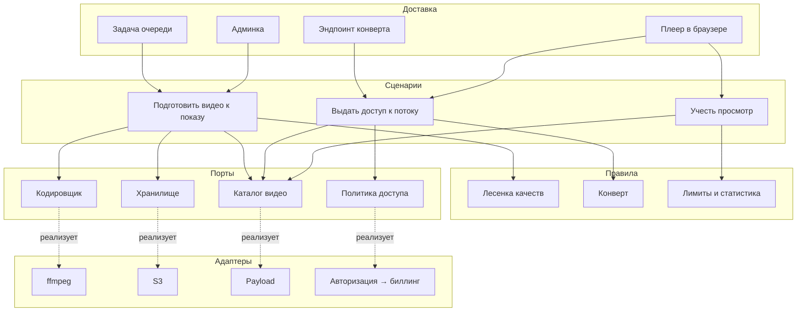
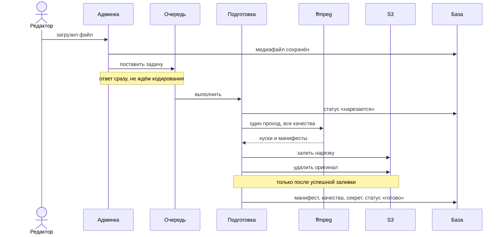
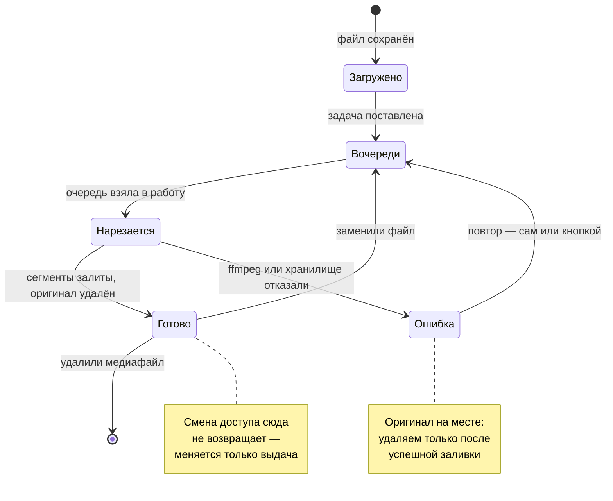
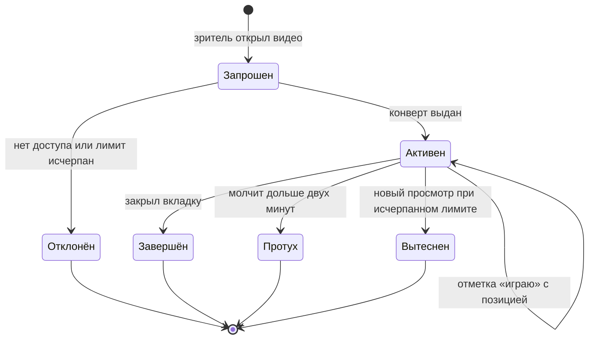
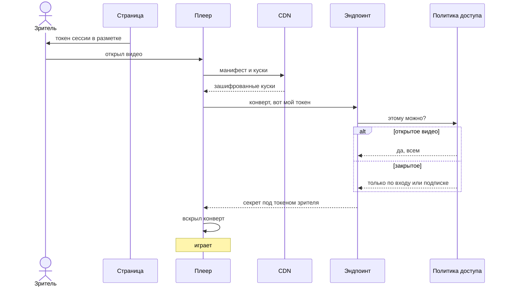
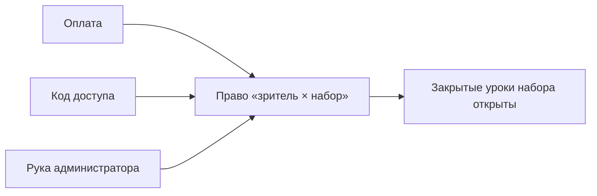

# Видео: нарезка, доступ, просмотры

> Загрузил видео в админку — дальше всё само. Зритель получает плеер с мгновенным стартом,
> перемоткой на любую секунду и выбором качества. Раздача с CDN, хранение — подключённый S3.

## Что решаем

Обычный `mp4` в теге `<video>` отдаётся одним файлом в одном качестве. На телефоне в поле это
либо долгая загрузка ролика в 1080p, либо мыло для всех, а перемотка тянет файл целиком.
Плюс такой файл нельзя закрыть: ссылка на него либо публична, либо не работает.

Поэтому видео режется на короткие сегменты в нескольких качествах (HLS) и всегда шифруется.
Дальше публичность — это не способ хранения, а **политика выдачи ключа**.

## Слои

Границы проведены так, чтобы механика нарезки ничего не знала ни о Payload, ни об S3, ни о том,
кому можно смотреть. Каждый следующий слой зависит только от абстракций предыдущего.

Практический смысл границ: заменить S3 на другое хранилище, ffmpeg на внешний сервис
кодирования, а проверку «авторизован ли» на биллинг — это замена одного адаптера, без правок
в сценариях и правилах.

## Как готовится видео

Кодирование живёт в фоновой задаче, а не в запросе загрузки: проход по ролику занимает минуты,
браузер отвалится по таймауту раньше. Очередь даёт повторы при сбое, историю запусков и кнопку
ручного запуска — писать своё для этого не нужно.

Оригинал удаляется после успешной нарезки, всегда. Смотрят через манифест, а гигабайтный файл
занимает больше места, чем обе ступени вместе. Если нарезка упала — оригинал на месте, задачу
можно перезапустить.

### Состояния медиафайла

Главное в этом автомате: **смена доступа не является переходом**. Открытое становится закрытым
и обратно без возврата в нарезку — иначе каждое переключение стоило бы минут кодирования.

Второе: `Ошибка` не теряет исходник. Удаление оригинала — часть перехода в `Готово`, и только
после того, как все сегменты легли в хранилище.

### Состояния просмотра

`Протух` нужен отдельно от `Завершён`: браузер не всегда успевает сообщить о закрытии вкладки,
и без истечения по времени счётчик онлайна копил бы мёртвые просмотры, а лимит блокировал бы
зрителя после каждого закрытия.

Куда уходит `Вытеснен` — решает владелец: либо новый зритель получает отказ, либо самый старый
просмотр закрывается в его пользу.

## Как выдаётся доступ

Сегменты зашифрованы одним постоянным секретом. Наружу он не выходит никогда: плеер получает
**конверт** — тот же секрет, зашифрованный персональным токеном зрителя.

Что это даёт:

- в панели разработчика нет секрета — там лежит конверт, привязанный к токену зрителя;
- сохранённый ответ бесполезен у другого человека: токен не его;
- переключение открытое ↔ закрытое — смена одного поля, мгновенно, без перенарезки;
- конверт идёт мимо CDN, иначе осел бы в кеше и защита развалилась бы.

Ограничение принято осознанно: тот, кто в своей же сессии подменит наш загрузчик ключа,
до секрета доберётся. Полностью это закрывает только DRM — см. раздел про альтернативы.

## Адреса: канал, ролик, набор

У ролика есть короткий код — семь символов из алфавита без похожих начертаний. Номер медиафайла
в адрес не годится: по нему ролики перебираются подряд, закрытые обнаруживаются увеличением
числа, а заодно видно, сколько всего загружено.

| Адрес               | Что показывает                                        |
| ------------------- | ----------------------------------------------------- |
| `/@<канал>`         | Страница автора: его открытые ролики                  |
| `/@<канал>/v/<код>` | Страница ролика: плеер, описание, разметка для поиска |
| `/@<канал>/p/<код>` | Страница набора: уроки по порядку, закрытые с замком  |

Канал — это **страница автора, а не отдельная сущность**. Участники в шаблоне уже есть, и завести
рядом «каналы» значило бы держать два профиля на одного человека. Поэтому `/@<автор>` собирает всё
его: сейчас ролики, дальше фото; статьи того же автора там уже есть.

Папкой с `@` в Next такой адрес не сделать — он трактует её как параллельный маршрут. Наружу
короткий адрес отдаётся перезаписью в `next.config`, внутри лежит обычный сегмент.

Ролик и набор ищутся отдельными эндпоинтами, а не запросом к медиа с фильтром: чтение участников
закрыто для посторонних, поэтому в обычной выдаче автор приходит номером и сверить канал нечем.
Адрес сверяется целиком — иначе один ролик открывался бы с любым именем в ссылке, и поисковик
видел бы десяток дублей одной страницы.

### Авторство и область хранения

Автор проставляется при загрузке сам и задаёт, куда лягут сегменты: `u<id автора>/hls/<uuid>`.
Ключом идёт неизменяемый идентификатор, а не имя канала — переименование иначе потребовало бы
перекладывать сегменты и обнулило бы кеш CDN.

Что это даёт: удалить всё хозяйство участника — это один префикс, а не обход базы; посчитать
занятое им место — тоже; и границы для разграничения доступа на уровне бакета уже проведены.

Авторство и права — разные вещи. Авторство это факт: кто залил. Права даёт роль: что человеку
можно, включая доступ в админку.

## Удаление с отсрочкой

Удаление ролика — единственное необратимое действие: оригинала уже нет, только сегменты. Поэтому
ролик сначала помечается, а стирается отложенно.

Помеченный ролик перестаёт отдавать конверт в тот же момент — иначе прямая ссылка продолжала бы
играть то, что владелец убрал. Срок хранения помеченного — настройка, месяц по умолчанию.

## Наборы, права и коды

> **Два разных «плейлиста».** В HLS так называется технический файл `master.m3u8` —
> оглавление кусков одного ролика; он появляется у каждого нарезанного видео. Набор же —
> это подборка роликов, и её у ролика может не быть вовсе. Дальше в тексте первый
> называется **манифестом**, второй — **набором**.

Набор — это **список и ничего больше**: он не меняет доступ входящих роликов. Каскад
«закрытый набор закрывает свои ролики» намеренно не сделан — он сделал бы невозможным платный
курс с бесплатным вводным уроком, а это основной способ курс продать.

Закрытые уроки открывает **право на набор** — отдельная запись «зритель × набор» со сроком и
пометкой, чем выдано. Ролик, входящий в несколько курсов, открывается правом на любой из них:
купивший один курс не должен упираться в тот же урок из другого.

Способ выдачи модели безразличен: когда придёт платёжка, она встанет рядом и ни плеер, ни нарезка
об этом не узнают.

### Кто такой зритель

Доступ принадлежит человеку, а не браузеру и не обязательно учётной записи. Право хранит то, чем
человек опознаётся: учётную запись, телефон или почту — и телефон с почтой приводятся к единому
виду, иначе тот же номер не совпадёт сам с собой при возврате с другого устройства.

Смысл в том, что покупку не теряют. Человек оплатил по номеру телефона, потом завёл учётную
запись на другой адрес — право находится по подтверждённому номеру, а не пропадает.

### Код доступа

Код — временный пароль, а не запись о доступе: погашённый, он превращается в право. Шесть
символов заглавными, длина и срок живут в настройках; алфавит взят по раскладке Crockford Base32 —
из каждой пары похожих начертаний в нём остаётся ровно один символ, поэтому привычная опечатка
(`O` вместо нуля, `I` или `L` вместо единицы) исправляется однозначно, а не отвергается.

Погашение дописывает набор прямо в токен зрителя и пересобирает подпись. Отсюда простота: нет
записи о доступе, нет привязки к браузеру, нечего отзывать — право живёт ровно столько, сколько
токен. За деньги так нельзя: покупку надо видеть, продлевать и отзывать, поэтому платный доступ
остаётся отдельной записью.

Ключевая настройка кода — **нужен ли вход**. Платный курс выдаётся с входом: иначе доступ нельзя
ни отозвать адресно, ни посчитать, а разошедшийся по чатам код открывает курс всем, кто его увидел.
Бесплатный промо-доступ уместно отдавать без регистрации, и такой код обязан быть ограничен сроком
и числом срабатываний — это проставляется само.

Гугл-аутентификатор рассматривался и отклонён: это второй фактор входа, а не пропуск к контенту.
Код каждые тридцать секунд означает телефон в руках при каждом сеансе, секрет всё равно надо к
кому-то привязать, а у аудитории приложение чаще не установлено.

## Просмотры и статистика

Считаются **просмотры**, а не сессии: две вкладки с видео у одного человека — два просмотра,
а вкладка с обычной страницей сайта просмотром не является.

Плеер при старте заводит идентификатор просмотра и раз в минуту отмечается, что играет,
передавая текущую позицию. Молчит пару минут — просмотр закрыт.

Один механизм закрывает три задачи:

| Задача                         | Как считается             |
| ------------------------------ | ------------------------- |
| Сколько смотрит сейчас         | живые отметки             |
| Лимит одновременных просмотров | их количество у аккаунта  |
| Удержание и досмотры           | позиции из тех же отметок |

Лимит и поведение при превышении — настройка владельца: отказать новому зрителю или вытеснить
самый старый просмотр. Против «купили вскладчину и смотрят вдесятером» это работает лучше
любого шифрования.

## Обоснование зависимостей

Каждая внешняя зависимость — это то, что придётся чинить, когда оно сломается. Ниже почему
взято именно это и что рассматривалось взамен.

### Кодирование — ffmpeg

Системная утилита в образе, вызывается как процесс.

| Вариант                                 | Почему не он                                                                                                                                                                           |
| --------------------------------------- | -------------------------------------------------------------------------------------------------------------------------------------------------------------------------------------- |
| npm-обёртки над ffmpeg                  | Ломаются на каждом обновлении и добавляют слой без пользы: набор ключей ffmpeg стабилен годами, обёртка — нет.                                                                         |
| `ffmpeg.wasm` в браузере                | В разы медленнее нативного, требует открытой вкладки на всё время, съедает батарею телефона. Контент грузят с объекта, это исключено.                                                  |
| Внешний сервис (Mux, Cloudflare Stream) | Ежемесячный счёт за каждый инстанс шаблона и зависимость от чужого тарифа. Для сайта подрядчика с десятком роликов — неоправданно. Порт `Кодировщик` оставляет такую замену возможной. |

Лицензия ffmpeg на наш код не распространяется: это отдельный процесс, а не библиотека,
слинкованная в приложение.

### Плеер — media-chrome + hls.js

Разделение осознанное: `hls.js` — движок, `media-chrome` — интерфейс.

| Вариант                       | Состояние на август 2026                     | Решение                                                                                         |
| ----------------------------- | -------------------------------------------- | ----------------------------------------------------------------------------------------------- |
| **hls.js** 1.7, Apache-2.0    | Обновляется, то же ядро под всеми оболочками | Берём как движок. У него есть подмена загрузчика ключа — без неё схема с конвертами невозможна. |
| **media-chrome** 4.19, MIT    | Живой, от Mux                                | Берём как интерфейс: веб-компоненты, стилизуются нашими токенами.                               |
| **vidstack** 0.6.15, MIT      | Последний релиз апрель 2024                  | Отклонён: два года без обновлений.                                                              |
| **plyr** 3.8.4, MIT           | Редкие обновления, вливается в Video.js v10  | Отклонён: переезжает.                                                                           |
| **video.js** 8.24, Apache-2.0 | Живой, но v10 в переписывании                | Отклонён: класть в шаблон библиотеку в разгар мажорной переделки рано.                          |
| Свой плеер с нуля             | —                                            | Отклонён: месяцы работы на то, что уже сделано, и собственные баги вместо чужих исправленных.   |

### Хранилище — @aws-sdk/client-s3

Официальный SDK, уже в зависимостях ради загрузки медиа. Отдельная библиотека под сегменты
не нужна. Совместимо с любым S3-провайдером, включая MinIO для локальной разработки.

### Очередь — Payload Jobs Queue

Встроенная: повторы, история запусков, кнопка ручного запуска в админке.

| Вариант                   | Почему не он                                                                                  |
| ------------------------- | --------------------------------------------------------------------------------------------- |
| BullMQ                    | Тянет Redis в стек ради одной задачи.                                                         |
| node-cron в процессе      | Нет истории, нет повторов, нет ручного запуска, умирает вместе с процессом.                   |
| Системный cron на сервере | То же самое плюс невидимость для владельца сайта. Годится как запасной путь, не как основной. |

### Шифрование — AES-128 средствами ffmpeg, конверты на node:crypto и WebCrypto

Штатная возможность формата, поддержана всеми плеерами. Конверты собираются стандартными
библиотеками — на сервере `node:crypto`, в браузере `WebCrypto`, оба без зависимостей.

Рассматривался и отклонён **DRM** (Widevine, FairPlay, PlayReady): расшифровка уходит в закрытый
модуль браузера, и секрет действительно не достать. Цена — лицензионный сервер, сертификат Apple
для FairPlay, упаковка контента в другой формат и поддержка трёх систем вместо одной. При этом
запись экрана DRM не закрывает, то есть главный канал утечки остаётся открытым. Вместо него
берём видимую метку с именем зрителя поверх кадра: запись экрана она переживает и ведёт прямо
к тому, кто слил.

## Что настраивается без разработчика

| Настройка                                   | Где                     |
| ------------------------------------------- | ----------------------- |
| В какие качества резать                     | Настройки сайта → Видео |
| Длина кода доступа и сколько он живёт       | Настройки сайта → Видео |
| На сколько дней код открывает доступ        | Настройки сайта → Видео |
| Через сколько дней стирать удалённые ролики | Настройки сайта → Видео |
| Кто может смотреть ролик                    | Карточка медиафайла     |
| Название и описание ролика                  | Карточка медиафайла     |
| Состав набора и порядок уроков              | Карточка набора         |
| Кому открыт набор и до какой даты           | Доступы                 |
| Коды и ссылки, открывающие набор            | Коды доступа            |
