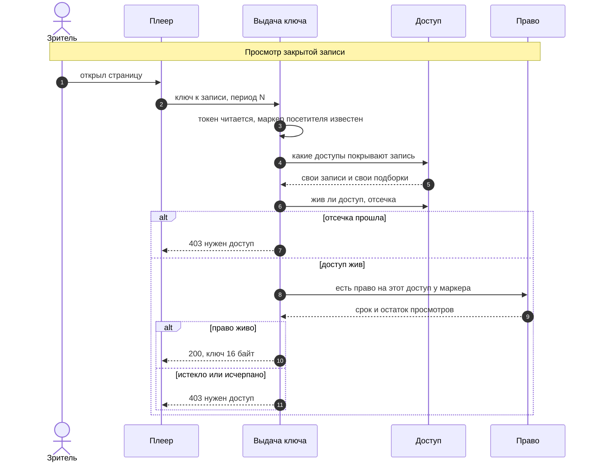
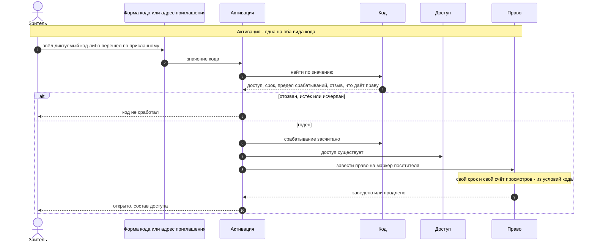
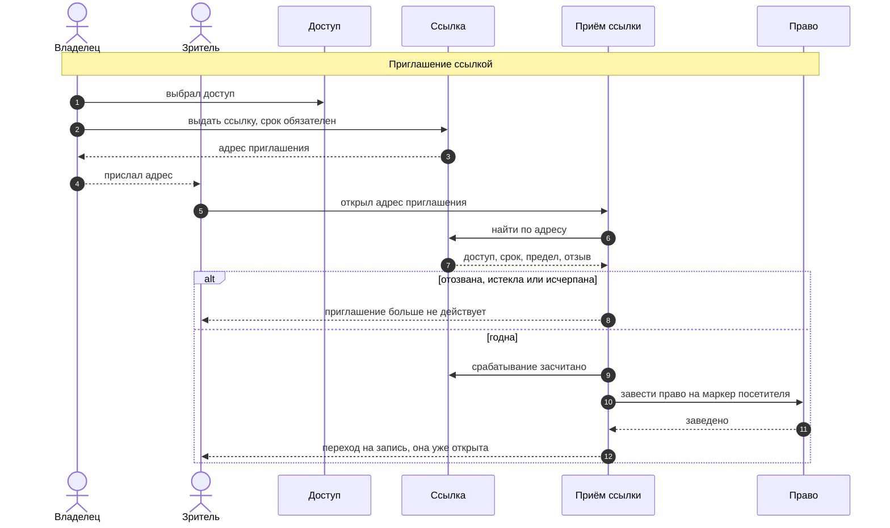
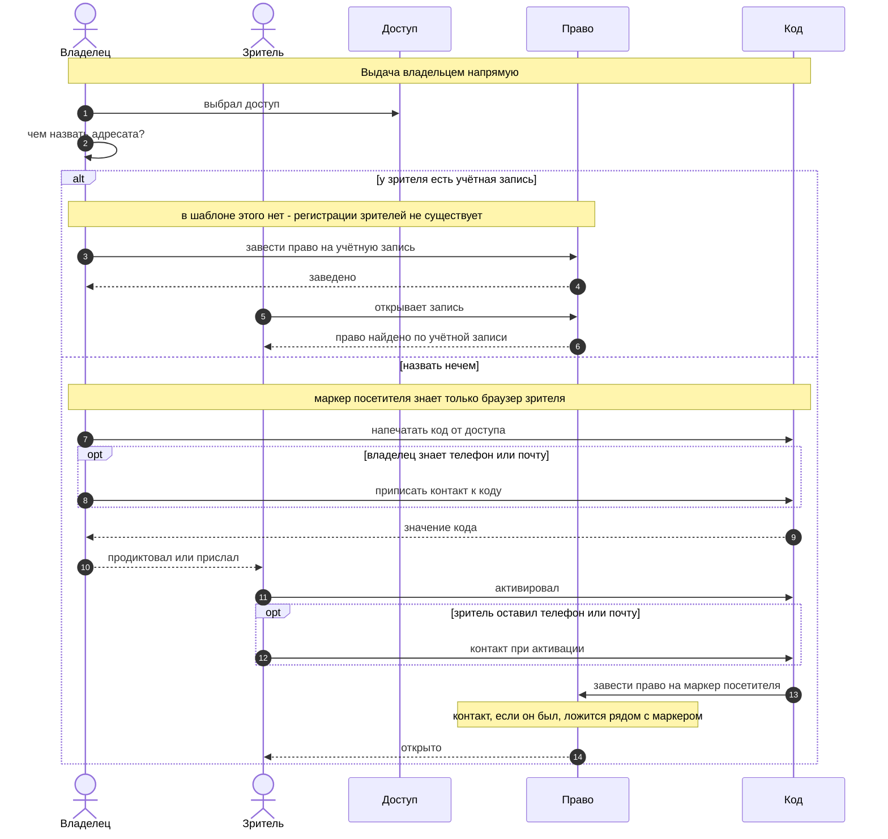
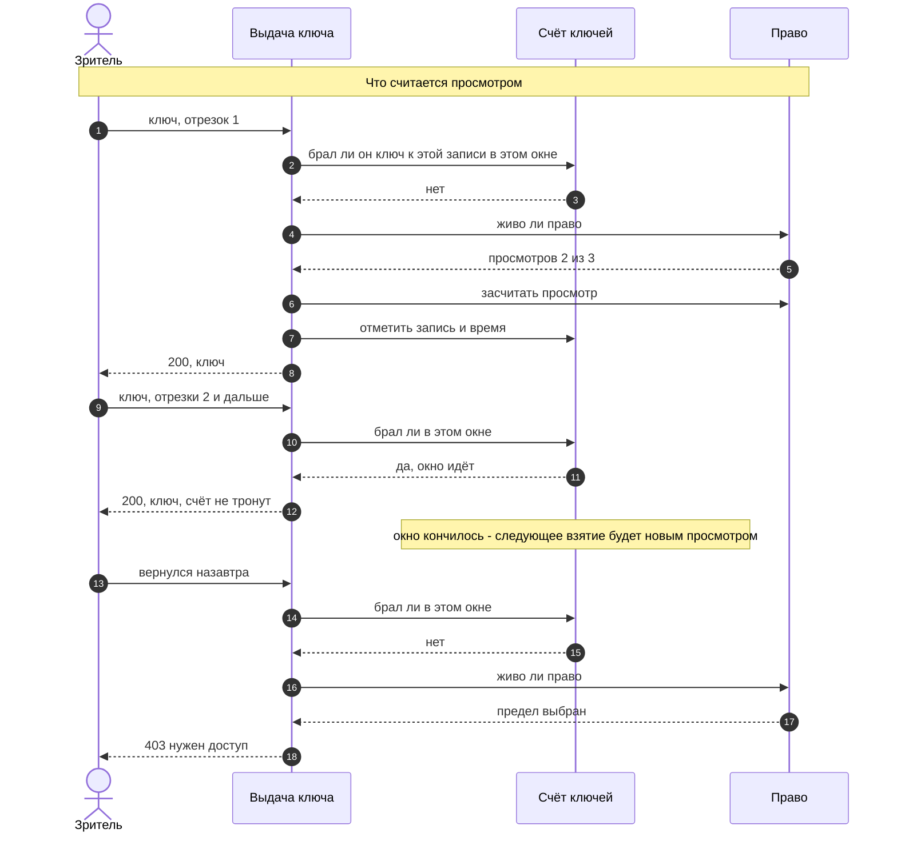
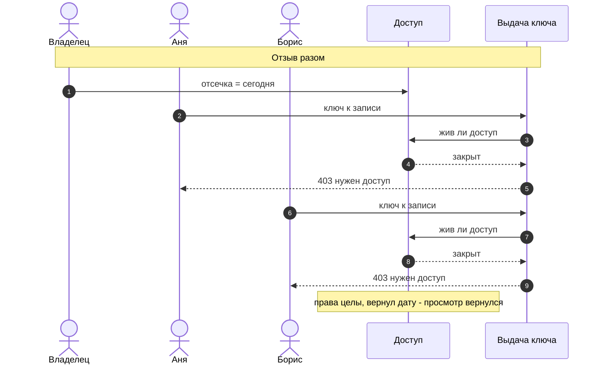
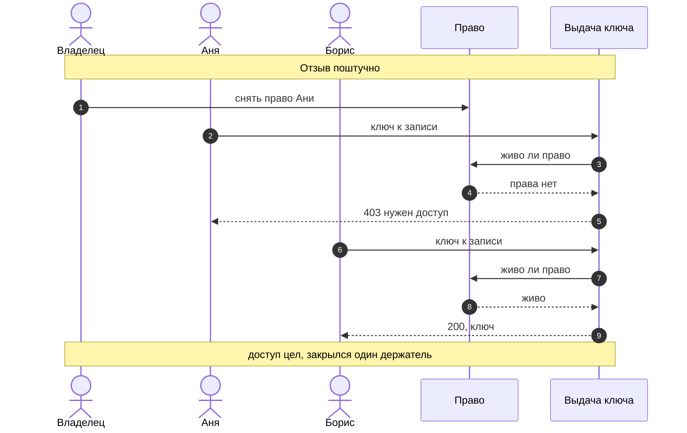

# Доступ: потоки

> Последовательности, которыми живёт модель из [`41-access.md`](41-access.md).
> Правила там, здесь - порядок шагов.

Шесть последовательностей, которыми модель живёт. Читаются сверху вниз: слева люди,
правее то, что решает.

### Просмотр закрытой записи

Проверка в два шага и в этом порядке: жив ли доступ, и только потом смотрим право.

### Активация кода

Одна на оба вида: различается только то, откуда пришло значение - из формы
на странице или из адреса приглашения.

### Приглашение ссылкой

Ссылка ведёт к тому же доступу, что и код, но это своя сущность: адрес длинный
и машинный, срок обязателен, отзывают её галкой, не дожидаясь срока.

### Выдача владельцем напрямую

Упирается в то, чем назвать адресата: маркер посетителя знает только его браузер.

### Счёт просмотров

Просмотр - это первое взятие ключа к записи в пределах окна, а не каждый запрос:
ключ спрашивают на каждый отрезок потока.

### Отзыв

Разом - датой отсечки у доступа; поштучно - снятием одного права.

